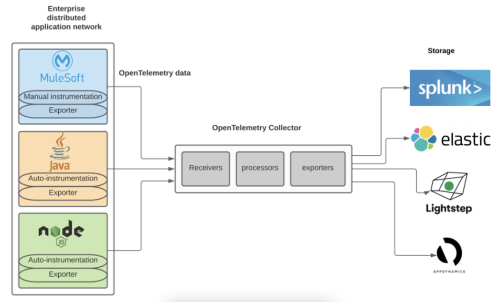

# Awesome OpenTelemetry 

A curated list of OpenTelemetry resources.

---

## What is OpenTelemetry?
OpenTelemetry is a collection of tools, APIs, and SDKs. Use it to instrument, generate, collect, and export telemetry data (metrics, logs, and traces) to help you analyze your software’s performance and behavior

---

## Contribute

Contributions welcome! Read the [contribution guidelines](contributing.md) first.

## Contents

- [Books](#books)
- [Videos](#videos)
- [Blogs](#blogs)
- [Distributed Tracing Solutions](#distributed-tracing-solutions)
  * [Open Source](#open-source)
  * [Vendors](#vendors)
- [Terminology](#terminology)
- [Quickstart](#quickstart)
- [OpenTelemetry Instrumentation](#opentelemetry-instrumentation)
  * [Native - Supported Languages](#native---supported-languages)
  * [Vendors Distro](#vendors-distro)
- [Components](#components)
  * [Client](#client)
  * [Agent](#agent)
  * [OTLP](#otlp)
  * [Collector](#collector)
    + [Receivers](#receivers)
    + [Processors](#processors)
    + [Exporters](#exporters)
  * [Storage](#storage)
  * [Ingester](#ingester)
  * [UI](#ui)
- [Newsletters](#newsletters)
- [Podcasts](#podcasts)
- [Events](#events)
- [Twitter](#twitter)
- [Case Studies](#case-studies)
- [Community](#community)

## Books

> Books about OpenTelemetry and Distributed Tracing

- [The Future of Observability with OpenTelemetry](https://www.oreilly.com/library/view/the-future-of/9781098118433/)
- [Distributed Tracing in Practice](https://www.oreilly.com/library/view/distributed-tracing-in/9781492056621/)
- [Mastering Distributed Tracing](https://www.oreilly.com/library/view/mastering-distributed-tracing/9781788628464/)
- [Distributed Systems Observability](https://www.oreilly.com/library/view/distributed-systems-observability/9781492033431/)
- [Distributed Tracing with Jaeger, Kubernetes, and Istio](https://www.manning.com/liveprojectseries/distributed-tracing-ser)
- [Cloud-Native Observability with OpenTelemetry](https://www.packtpub.com/product/cloud-native-observability-with-opentelemetry/9781801077705)
- [Practical OpenTelemetry](https://link.springer.com/book/10.1007/978-1-4842-9075-0)

## Videos

> Videos about OpenTelemetry and Distributed Tracing

- [KubeConEU-2023 Ingesting 6.5 Tb of Telemetry Data Daily Through Open Telemetry Protocol and Collectors](https://www.youtube.com/watch?v=aDysORX1zIs)
- [OpenTelemetry meetup with Yuri Shkuro on Distributed Tracing, Jaeger and OpenTelemetry](https://www.youtube.com/watch?v=OebhomcdJ4g)
- [SREcon21 - Take Me Down to the Paradise City Where the Metric Is Green and Traces Are Pretty](https://www.youtube.com/watch?v=AKys5tuTvV0)
- [The OpenTelemetry Bootcamp](https://www.aspecto.io/opentelemetry-bootcamp/)
- [OpenTelemetry Twitch](https://www.twitch.tv/opentelemetry)
- [Honeycomb & OpenTelemetry: Instrumentation Should Be Boring](https://www.youtube.com/watch?v=bsVyry8U47Q)
- [OpenTelemetry Course - Understand Software Performance](https://www.youtube.com/watch?v=r8UvWSX3KA8&t=2969s)
- [How OpenTelemetry is Eating the World](https://www.youtube.com/watch?v=DbaO0Xxv34c)
- [OpenTelemetry Agent and Collector: Telemetry Built-in Into All Software](https://www.youtube.com/watch?v=cHiFSprUqa0)
- [Introduction to Tracing : OpenTelemetry & Opentracing](https://www.youtube.com/watch?v=idDu_jXqf4E)
- [OpenTelemetry and observability at Shopify, Splunk, and Google](https://www.youtube.com/watch?v=S_L0ohIJuF0)
- [Live Panel: OpenTelemetry Metrics Deep Dive](https://www.youtube.com/watch?v=L-Ss8PtWlRA)
- [Monitoring Go Applications with OpenTelemetry](https://www.youtube.com/watch?v=R3A3BjpMi6k)
- [Getting Started with OpenTelemetry, Grafana, and More](https://www.youtube.com/watch?v=ifwfyMNcMiM)
- [Monitoring Elixir With OpenTelemetry](https://www.youtube.com/watch?v=4OBtc_eIKIE)
- [Honeycomb - OpenTelemetry Collector](https://www.youtube.com/watch?v=7T2SdvYW-eI)
- [OpenTelemetry Architecture Overview](https://www.youtube.com/watch?v=O-9gV3xuqwg)
- [Jaeger Intro - Yuri Shkuro, Uber](https://www.youtube.com/watch?v=UNqilb9_zwY)
- [Prometheus, OpenMetrics, and the CNCF observability ecosystem](https://www.youtube.com/watch?v=j3nFFHSosnI)
- [OpenTelemetry and observability at Shopify, Splunk, and Google](https://www.youtube.com/watch?v=S_L0ohIJuF0)
- [Understanding Microservices with Distributed Tracing](https://www.youtube.com/watch?v=URCLeycMrhU)
- [OpenTelemetry Deep Dive](https://www.youtube.com/playlist?list=PLv9DlQuUaXQc7PWxyGuJJnHE856zJYpse)
- [OpenTelemetry Java Auto-Instrumentation](https://www.youtube.com/watch?v=88ZjCbT6LPc)
- [Distributed Tracing Made Easy with .NET Core and OpenTelemetry](https://www.youtube.com/watch?v=s9UNr1oEMl4)
- [Getting Started with OpenTelemetry in Python](https://www.youtube.com/watch?v=WS-iDN2BOMs)
- [Standardising APM with OpenTelemetry and Elastic Observability](https://www.youtube.com/watch?v=Y6kQEhCvThU)
- [Distributed tracing with OpenTelemetry and Cloud Trace](https://www.youtube.com/watch?v=NQeK8Kbu6UM)
- [The what and why of distributed tracing](https://www.cncf.io/online-programs/the-whats-and-whys-of-distributed-tracing/)
- [Introduction to Tracing](https://www.youtube.com/watch?v=idDu_jXqf4E)
- [Understanding Microservices with Distributed Tracing](https://www.youtube.com/watch?v=URCLeycMrhU)
- [Why You Should Use Distributed Tracing Tools](https://www.youtube.com/watch?v=-NgcStx_w7A)
- [Getting Started with Jaeger - Joe Elliott, Grafana Labs](https://www.youtube.com/watch?v=aMZoUIG-mgY)
- [Distributed Tracing Made Easy with .NET Core and OpenTelemetry](https://www.youtube.com/watch?v=s9UNr1oEMl4)
- [Adding OpenTelemetry to Production Apps](https://www.youtube.com/watch?v=ODQPERg82yQ)
- [Otel Instrumentation with SigNoz](https://www.youtube.com/playlist?list=PL0N8FjJpzGl_VLU-PedUdnWXUybA90pcP)
- [Effortlessly Monitor Your Node.JS App with OpenTelemetry: A Quick Tutorial](https://www.youtube.com/watch?v=Q03R_9_xAlA)

## Blogs

> Blogs about OpenTelemetry and Distributed Tracing

- [Beginner’s Guide to OpenTelemetry](https://logz.io/learn/opentelemetry-guide/) - Guide to OpenTelemetry.
- [Unpacking Observability: The Path to OpenTelemetry](https://storiesfromtheherd.com/unpacking-observability-the-path-to-opentelemetry-399f40fd8c4) - Blog post how to roll out OpenTelemetry to your organization. 
- [Sampling and rate-limiting](https://opentelemetry.uptrace.dev/guide/sampling.html) - Good write up about Sampling from Uptrace.
- [OpenTelemetry and Python](https://www.timescale.com/blog/opentelemetry-and-python-a-complete-instrumentation-guide/) - A Complete Instrumentation Guide from Timescale
- [OpenTelemetry Masterclass](https://developer.newrelic.com/opentelemetry-masterclass/) - OpenTelemetry Masterclass from New Relic
- [Honeycomb](https://www.honeycomb.io/blog/) - Blog posts about observability, monitoring, OpenTelemetry, and more.
- [Aspecto](https://www.aspecto.io/blog/) - Guides on how to use OpenTelemetry.
- [Jaeger](https://medium.com/jaegertracing/latest) - Blog posts from Jaeger.
- [Medium](https://medium.com/opentelemetry) - Medium posts about OpenTelemetry.
- [Dev.to](https://dev.to/search?q=OpenTelemetry) - Dev.to posts about OpenTelemetry.
- [Lightstep](https://lightstep.com/blog) - Blog posts and latest updates of OpenTelemetry.
- [From Distributed Tracing to APM](https://horovits.medium.com/from-distributed-tracing-to-apm-taking-opentelemetry-and-jaeger-up-a-level-12dfe85022da) - Taking OpenTelemetry and Jaeger Up a Level.
- [Evolving Distributed Tracing at Uber Engineering](https://eng.uber.com/distributed-tracing/) - A Distributed Tracing story at Uber.
- [What is OpenTelemetry?](https://codeboten.medium.com/what-is-opentelemetry-6a7e5c6901c5) - Blog post about OpenTelemetry and Observability.
- [Signoz](https://signoz.io/blog/) - News & updates on observability and application monitoring.
- [Taking Distributed Tracing Beyond Monitoring](https://logz.io/blog/finops-distributed-tracing/) - Observability into Your FinOps.
- [Authenticate your OpenTelemetry Collector using Azure ADAL](https://medium.com/@wtcampos/authenticate-your-opentelemetry-collector-using-azure-45e9419d06e9) - Authentication using Azure ADAL.
- [Deep Dive into OpenTelemetry for .NET](https://rehansaeed.com/deep-dive-into-open-telemetry-for-net/) - A four part guide how to use how to use OpenTelemetry with .NET.
- [Why is OpenTelemetry the future of instrumentation?](https://www.cncf.io/blog/2021/08/06/what-is-opentelemetry-and-why-is-it-the-future-of-instrumentation/) - A two part serie about Understanding OpenTelemetry.
- [OpenTelemetry Concepts](https://newrelic.com/blog/best-practices/opentelemetry-concepts) A two part serie about Understanding OpenTelemetry. (part 2)
- [Distributed Tracing with OpenTelemetry and Jaeger](https://iqfarhad.medium.com/distributed-tracing-with-opentelemetry-and-jaeger-e21e53b5c24e) - Tracing using OTEL agent and collector beside Jaeger.
- [Understanding OpenTelemetry and distributed tracing](https://medium.com/swlh/distributed-tracing-with-opentelemetry-part-1-6719df95a364) - Understanding OpenTelemetry and distributed tracing.
- [Distributed tracing and observability](https://www.dynatrace.com/news/blog/open-observability-part-1-distributed-tracing-and-observability/) - Blog post from Dynatrace about Open Observability.
- [An Introduction to Distributed Tracing](https://www.honeycomb.io/blog/an-introduction-to-distributed-tracing/) - Introduction to Distributed Tracing and the benefits of it.
- [What is Distributed Tracing?](https://www.splunk.com/en_us/data-insider/what-is-distributed-tracing.html) - Blog post from Spunk that explains what Distributed Tracing is.
- [OpenTelemetry: beyond getting started](https://medium.com/opentelemetry/opentelemetry-beyond-getting-started-5ac43cd0fe26) Explores scenarios for telemetry collection using OpenTelemetry.
- [Deploying Jaeger on Kubernetes](https://medium.com/jaegertracing/a-guide-to-deploying-jaeger-on-kubernetes-in-production-69afb9a7c8e5) - A Guide to Deploying Jaeger on Kubernetes in Production.
- [From Distributed Tracing to APM](https://horovits.medium.com/from-distributed-tracing-to-apm-taking-opentelemetry-and-jaeger-up-a-level-12dfe85022da) - Taking OpenTelemetry and Jaeger Up a Level
- [Take Jaeger for a HotROD ride](https://medium.com/opentracing/take-opentracing-for-a-hotrod-ride-f6e3141f7941) -  Blog post of OpenTracing using a demo application HotROD from Jaeger.
- [A beginner’s guide to OpenTelemetry](https://medium.com/@magstherdev/opentelemetry-d71d369c83d7)
- [Trace-Based Testing: The Next Step in Observability](https://thenewstack.io/trace-based-testing-the-next-step-in-observability/)
- [A Guide to OpenTelemetry](https://www.apmdigest.com/opentelemetry-1)
- [A Look at eBay’s Implementation of OpenTelemetry](https://telemetryhub.com/a-look-at-ebays-implementation-of-opentelemetry/) - Looking into one of the largest sites in the world and how they use OpenTelemetry.
- [APM vs. Application Performance Observability: What’s the Difference?](https://telemetryhub.com/apm-vs-apo-whats-the-difference/) - Understanding the difference between Observability/Opentelemetry and Application Performance Monitoring.
- [APM, Observability, or Both?](https://telemetryhub.com/apm-observability-or-both/)
- [Node.JS – Observability Tools: A Comprehensive Guide](https://telemetryhub.com/node-js-observability-tools/)
- [Running the OpenTelemetry Demo](https://telemetryhub.com/running-the-opentelemetry-demo/) - How to run the opentelemetry-demo project and why you should do it.
- [OpenTelemetry Visualizations](https://telemetryhub.com/opentelemetry-visualizations/) - How to use OTEL visualization data.
- [OpenTelemetry: An Open Source Community Driven Project](https://telemetryhub.com/opentelemetry-open-source-project/)
- [The Future of Observability](https://telemetryhub.com/observability-and-opentelemetry/)
- [What are OpenTelemetry Components?](https://telemetryhub.com/opentelemetry-components/)
- [How to Analyze OpenTelemetry Data: A Guide for Businesses](https://telemetryhub.com/solid-software-principles/)
- [OpenTelemetry vs OpenTracing and OpenCensus](https://telemetryhub.com/opentelemetry-vs-opentracing-and-opencensus/)
- [OpenTelemetry vs. OpenMetrics for Observability](https://telemetryhub.com/opentelemetry-vs-openmetrics-for-observability/)
- [Pros and Cons of Installing the OpenTelemetry Collector](https://telemetryhub.com/installing-the-opentelemetry-collector/)
- [The Ultimate OpenTelemetry Guide for Developers](https://telemetryhub.com/the-ultimate-opentelemetry-guide-for-developers/)
- [Distributed System Debugging with OpenTelemetry and Teletrace](https://medium.com/gitconnected/distributed-system-debugging-with-opentelemetry-and-teletrace-real-world-examples-15e6e0a9c49b)
- [Observability strategies to not overload engineering teams — OpenTelemetry Strategy](https://itnext.io/observability-strategies-to-not-overload-engineering-teams-opentelemetry-strategy-d064b806435c)
- [OpenTelemetry in Action](https://medium.com/@magstherdev/opentelemetry-in-action-fc61263c852) - Hands-On guide to get started with OpenTelemetry using the OpenTelemetry demo application.
  
## Distributed Tracing Solutions

### Open Source

- [Jaeger](https://www.jaegertracing.io)
- [OpenTelemetry](https://opentelemetry.io)
- [Zipkin](https://zipkin.io)
- [Teletrace](https://github.com/teletrace/teletrace) - **Deprecated**
- [Tracetest](https://github.com/kubeshop/tracetest)
- [SigNoz](https://signoz.io/)
- [OpenTracing](https://opentracing.io) - **Deprecated**
- [OpenCensus](https://opencensus.io) - **Deprecated**

### Vendors

- [Aspecto](https://www.aspecto.io)
- [AWS X-Ray](https://aws.amazon.com/xray/)
- [Honeycomb](https://www.honeycomb.io)
- [Datadog](https://docs.datadoghq.com/getting_started/tracing/)
- [Dynatrace](https://www.dynatrace.com)
- [Instana](https://www.instana.com)
- [Lightstep](https://lightstep.com)
- [LogicMonitor](https://www.logicmonitor.com)
- [Logz.io](https://logz.io)
- [New Relic](https://newrelic.com)
- [SigNoz](https://signoz.io/)
- [Splunk](https://www.splunk.com)
- [TelemetryHub](https://telemetryhub.com/)
- [Coralogix](https://coralogix.com/)

## Terminology
- [Components](https://www.jaegertracing.io/docs/1.30/architecture/#terminology)
- [Glossary](https://opentelemetry.io/docs/concepts/glossary/)

## Quickstart
- [OpenTelemetry](https://opentelemetry.io/docs/concepts/)
- [Aspecto](https://docs.aspecto.io/v1/getting-started/quick-start) **Vendor**
- [AWS X-Ray](https://aws.amazon.com/xray/getting-started/) **Vendor**
- [Datadog](https://docs.datadoghq.com/getting_started/tracing/) **Vendor**
- [Dynatrace](https://www.dynatrace.com/support/help/extend-dynatrace/opentelemetry/opentelemetry-ingest) **Vendor**
- [Elastic](https://www.elastic.co/guide/en/apm/get-started/current/distributed-tracing.html) **Vendor**
- [Honeycomb](https://docs.honeycomb.io/getting-started/quickstart/) **Vendor**
- [Lightstep](https://opentelemetry.lightstep.com/) **Vendor**
- [LogicMonitor](https://www.logicmonitor.com/support/tracing/getting-started-with-tracing) **Vendor**
- [Logz.io](https://docs.logz.io/shipping/tracing-sources/opentelemetry.html) **Vendor**
- [New Relic](https://docs.newrelic.com/docs/distributed-tracing/concepts/quick-start/) **Vendor**
- [SigNoz](https://signoz.io/docs/instrumentation/overview/) **Vendor**
- [Splunk](https://www.splunk.com/en_us/blog/devops/getting-started-with-the-splunk-distribution-of-opentelemetry-python.html) **Vendor**
- [Teletrace](https://docs.teletrace.io/user-guide/quick_start/) **OpenSource**
- [Lightstep](https://opentelemetry.lightstep.com/) **Vendor**
- [TelemetryHub](https://app.telemetryhub.com/docs#quickStart) **Vendor**
- [Coralogix](https://coralogix.com/docs/opentelemetry/) **Vendor**

## OpenTelemetry Instrumentation

### Native - Supported Languages
- [C++](https://opentelemetry.io/docs/instrumentation/cpp/) - A language-specific implementation of OpenTelemetry in C++.
- [.NET](https://opentelemetry.io/docs/instrumentation/net/automatic/) - **supports Automatic Instrumentation**
- [Erlang/Elixir](https://opentelemetry.io/docs/instrumentation/erlang/) - A language-specific implementation of OpenTelemetry in Erlang/Elixir.
- [Go](https://opentelemetry.io/docs/instrumentation/go/getting-started/) -A language-specific implementation of OpenTelemetry in Go.
- [Java](https://opentelemetry.io/docs/instrumentation/java/automatic/) - **supports Automatic Instrumentation**
- [JavaScript](https://opentelemetry.io/docs/instrumentation/js/instrumentation/) - JS logo A language-specific implementation of OpenTelemetry in JavaScript (for Node.JS & the browser).
- [PHP](https://opentelemetry.io/docs/instrumentation/php/getting_started/) - A language-specific implementation of OpenTelemetry in PHP.
- [Python](https://opentelemetry.io/docs/instrumentation/python/getting-started/) - A language-specific implementation of OpenTelemetry in Python.
- [Ruby](https://opentelemetry.io/docs/instrumentation/ruby/automatic/) - **supports Automatic Instrumentation**
- [Rust](https://opentelemetry.io/docs/instrumentation/rust/) - A language-specific implementation of OpenTelemetry in Rust.
- [Swift](https://opentelemetry.io/docs/instrumentation/swift/) - A language-specific implementation of OpenTelemetry in Swift.

### Vendors Distro
Distributions and vendors who natively support OpenTelemetry in their commercial products.

- [Aspecto](https://www.aspecto.io/)
- [AWS](https://aws-otel.github.io/)
- [Azure](https://docs.microsoft.com/azure/azure-monitor/app/opentelemetry-overview)
- [Datadog](https://docs.datadoghq.com/tracing/setup_overview/open_standards)
- [Dynatrace](https://www.dynatrace.com/support/help/how-to-use-dynatrace/transactions-and-services/service-monitoring-settings/opentelemetry/)
- [Elastic](https://www.elastic.co/guide/en/apm/get-started/current/open-telemetry-elastic.html)
- [F5](https://github.com/open-telemetry/opentelemetry-collector-contrib/tree/main/exporter/f5cloudexporter)
- [Grafana Labs](https://grafana.com/oss/opentelemetry/)
- [Honeycomb](https://docs.honeycomb.io/getting-data-in/)
- [Lightstep](https://github.com/lightstep?q=launcher)
- [Logz.io](https://logz.io/)
- [New Relic](https://newrelic.com/solutions/opentelemetry)
- [Sentry Software](https://www.sentrysoftware.com/products/hardware-sentry-opentelemetry-collector.html)
- [Splunk](https://www.splunk.com/en_us/blog/conf-splunklive/announcing-native-opentelemetry-support-in-splunk-apm.html)
- [SigNoz](https://signoz.io/)
- [Sumo Logic](https://help.sumologic.com/Traces/Getting_Started_with_Transaction_Tracing)
- [TelemetryHub](https://telemetryhub.com/)
- [Uptrace](https://uptrace.dev/)

[Full list of vendors that supports OpenTelemetry](https://opentelemetry.io/vendors/)

## OpenTelemetry Registry
> The [OpenTelemetry Registry](https://opentelemetry.io/registry/) allows you to search for instrumentation libraries, tracer implementations, utilities, and other useful projects in the OpenTelemetry ecosystem.

## Components

**Reference Architecture**

### Client
Client libraries used to instrument applications for distributed tracing.

- [OpenTelemetry](https://opentelemetry.io/docs/concepts/instrumenting-library/)

**Other Libraries**
- [Jaeger](https://www.jaegertracing.io/docs/1.31/client-libraries/)
- [Zipkin](https://zipkin.io/pages/tracers_instrumentation)

---

Refer from [OpenTelemetry Official Document](https://github.com/open-telemetry/opentelemetry-specification/blob/main/specification/overview.md)

---

### Agent
An agent listens for spans, which it batches and sends to the Collector. The agent is meant to be placed on the same host as the instrumented application. This is typically accomplished by having a sidecar in container environments such as Kubernetes or running it as a DaemonSet (on each node).

- [OpenTelemetry](https://opentelemetry.io/docs/collector/getting-started/)

### OTLP
OTLP is the default OpenTelemetry protocol for transmitting telemetry data.
Other formats can be **Zipkin** or **Jaeger**.

### Collector
Similar to the Agent, the Collector is able to receive spans and place them in an internal queue for processing.

The OpenTelemetry [collector](https://opentelemetry.io/docs/collector/) is a **vendor-agnostic** way to receive, process and export telemetry data.

 
The Collector consists of three components that access telemetry data:
 - [Receivers](https://opentelemetry.io/docs/collector/configuration/#receivers) - How data gets into the Collector
 - [Processors](https://opentelemetry.io/docs/collector/configuration/#processors) - Processors are run on data between being received and being exported.
 - [Exporters](https://opentelemetry.io/docs/collector/configuration/#exporters) - How you send data to one or more backends/destinations
 
For vendor specific receivers/exporters, see [OpenTelemetry Collector Contrib](https://github.com/open-telemetry/opentelemetry-collector-contrib)

#### Receivers
> A receiver is how data gets into the OpenTelemetry Collector. Generally, a receiver accepts data in a specified format, translates it into the internal format and passes it to processors and exporters defined in the applicable pipelines. 
[source](https://github.com/open-telemetry/opentelemetry-collector/blob/main/receiver/README.md)

[List of supported receivers](https://github.com/open-telemetry/opentelemetry-collector-contrib/tree/main/receiver)

#### Processors
> Processors are run on data between being received and being exported. Processors are optional though [some are recommended](https://github.com/open-telemetry/opentelemetry-collector/tree/main/processor#recommended-processors).
[source](https://opentelemetry.io/docs/collector/configuration/#processors)

[List of supported processors](https://github.com/open-telemetry/opentelemetry-collector-contrib/tree/main/processor)

#### Exporters
> An exporter is how you send data to one or more backends/destinations. Exporters may support one or more data sources.

[List of supported exporters](https://github.com/open-telemetry/opentelemetry-collector-contrib/tree/main/exporter)

---

[source](https://www.avioconsulting.com/hs-fs/hubfs/OpenTelemetry%20-%20EDAN.png?width=1248&name=OpenTelemetry%20-%20EDAN.png)

---

### Storage
The OpenTelemetry collectors require a persistent storage backend.

- [Cassandra](https://cassandra.apache.org/_/index.html) - open source NoSQL distributed database 
- [Elastic](https://www.elastic.co) - open search and analytics solution
- [Jaeger](https://github.com/jaegertracing/jaeger) - distributed tracing platform created by Uber Technologies
- [Promscale](https://www.timescale.com/promscale) - an open source observability backend for traces and metrics ** deprecated **
- [SigNoz](https://signoz.io/) - Open Source Metrics, Traces and Logs in a single pane
- [SkyWalking](https://github.com/apache/skywalking) - open source APM system
- [Splunk](https://www.splunk.com/)
- [Teletrace](https://github.com/teletrace/teletrace) - Open source distributed tracing tool.
- [Tempo](https://grafana.com/oss/tempo/) - Grafana Tempo is an open source, easy-to-use, and high-scale distributed tracing backend.
- [Thanos](https://thanos.io/)

### Ingester
You can optional use an **Ingester**, which is a service that reads data from Kafka and writes to the storage backend.

- [Kafka](https://kafka.apache.org) - open-source distributed event streaming platform

### UI
Visualizing the distributed tracing data.

- [Jaeger](https://github.com/jaegertracing/jaeger-ui)
- [TelemetryHub](https://telemetryhub.com/)
- [Zipkin](https://zipkin.io)
- [Teletrace](https://github.com/teletrace/teletrace)

---

## Newsletters
- [o11y news!](https://o11y.news) -  Newsletter about Observability
- [Observability news](https://buttondown.email/o11y.news) - Updates around observability (o11y) with a special focus on open source
- [The new stack](https://thenewstack.io/category/monitoring/) - A newsletter digest of the week’s most important stories & analyses.

## Podcasts
- [Changelog](https://changelog.com/topic/observability)
- [OpenTelemetry in use](https://inuse.o11y.engineering/episodes)
- [SE Radio 556: Alex Boten on Open Telemetry](https://www.se-radio.net/2023/03/se-radio-556-alex-boten-on-open-telemetry/)

## Events
- [CNCF](https://www.cncf.io/events/) - CNCF Events
- [SREcon](https://www.usenix.org/conference/srecon22americas)

## Twitter
- [Opentelemetry](https://twitter.com/opentelemetry)
- [Opentracing](https://twitter.com/opentracing)
- [Opencensusio](https://twitter.com/opencensusio)
- [Kubernetesio](https://twitter.com/kubernetesio)
- [JaegerTracing](https://twitter.com/JaegerTracing)
- [CNCF](https://twitter.com/CloudNativeFdn)
- [SREcon](https://twitter.com/srecon)
- [LightstepHQ](https://twitter.com/LightstepHQ)
- [Yuri Shkuro](https://twitter.com/YuriShkuro) - Creator of Jaeger
- [Ted Young](https://twitter.com/tedsuo) - Co-founded the OpenTelemetry project
- [Liz Fong-Jones](https://twitter.com/lizthegrey) - Advocate at Honeycomb.io
- [Ben Sigelman](https://twitter.com/el_bhs) - Co-created OpenTelemetry & OpenTracing
- [Juraci Paixão Kröhling](https://twitter.com/jpkrohling) -  Opentelemetry maintainer.
- [Charity Majors](https://twitter.com/mipsytipsy) - cofounder/CTO Honeycomb.io
- [Awesome Opentelemetry](https://github.com/magsther/awesome-opentelemetry) - A curated list of OpenTelemetry resources.

## Case Studies
- [CNCF](https://www.cncf.io/case-studies/)

## Community
- [Join the OpenTelemetry community](https://opentelemetry.io/community/)
- [Mailing Lists](https://github.com/open-telemetry/community#mailing-lists)
- [OpenTelemetry community content](https://github.com/open-telemetry/community)
- [OpenTelemetry Public Calendar](https://calendar.google.com/calendar/embed?src=google.com_b79e3e90j7bbsa2n2p5an5lf60%40group.calendar.google.com)
- [Chat with other project developers on Slack](https://cloud-native.slack.com/archives/CJFCJHG4Q)
- [Stack Overflow](https://stackoverflow.com/questions/tagged/open-telemetry)
- [OpenTelemetry at Reddit](https://www.reddit.com/r/OpenTelemetry/)
- [OpenTelemetry - Current Status](https://opentelemetry.io/status/)
- [Teletrace](https://join.slack.com/t/teletrace/shared_invite/zt-1qv0kogcn-KlbBB2yS~gUCGszZoSpJfQ)

