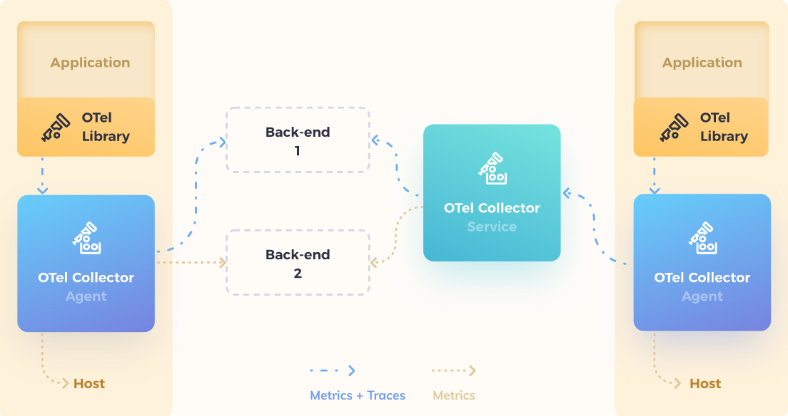
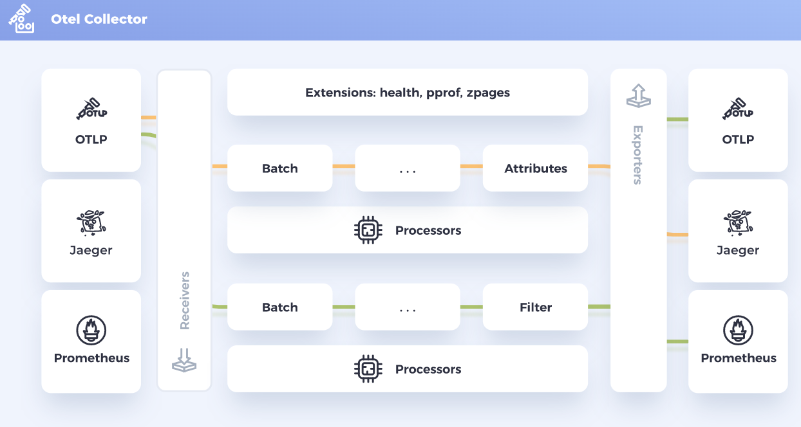

# Awesome OpenTelemetry 

A curated list of OpenTelemetry resources.

**What is OpenTelemetry?**
OpenTelemetry is a collection of tools, APIs, and SDKs. Use it to instrument, generate, collect, and export telemetry data (metrics, logs, and traces) to help you analyze your software’s performance and behavior

Reference Architecture

---

Otel Collector

---

## Contribute

Contributions welcome! Read the [contribution guidelines](contributing.md) first.

## Books

- [Distributed Tracing in Practice](https://www.oreilly.com/library/view/distributed-tracing-in/9781492056621/)
- [Mastering Distributed Tracing](https://www.oreilly.com/library/view/mastering-distributed-tracing/9781788628464/)
- [Distributed Systems Observability](https://www.oreilly.com/library/view/distributed-systems-observability/9781492033431/)
- [Distributed Tracing with Jaeger, Kubernetes, and Istio](https://www.manning.com/liveprojectseries/distributed-tracing-ser)

## Videos
- [OpenTelemetry Twitch](https://www.twitch.tv/opentelemetry)
- [The OpenTelemetry Bootcamp](https://www.aspecto.io/opentelemetry-bootcamp/)
- [OpenTelemetry Course - Understand Software Performance](https://www.youtube.com/watch?v=r8UvWSX3KA8&t=2969s)
- [How OpenTelemetry is Eating the World](https://www.youtube.com/watch?v=DbaO0Xxv34c)
- [Jaeger Intro - Yuri Shkuro, Uber](https://www.youtube.com/watch?v=UNqilb9_zwY)
- [OpenTelemetry and observability at Shopify, Splunk, and Google](https://www.youtube.com/watch?v=S_L0ohIJuF0)
- [Understanding Microservices with Distributed Tracing](https://www.youtube.com/watch?v=URCLeycMrhU)
- [OpenTelemetry Deep Dive](https://www.youtube.com/playlist?list=PLv9DlQuUaXQc7PWxyGuJJnHE856zJYpse)

## Distributed Tracing Solutions

### Open Source

- [Jaeger](https://www.jaegertracing.io)
- [OpenTelemetry](https://opentelemetry.io)
- [Zipkin](https://zipkin.io)
- [OpenTracing](https://opentracing.io) - **Deprecated**
- [OpenCensus](https://opencensus.io) - **Deprecated**

### Vendors

- [Aspecto](https://www.aspecto.io)
- [AWS X-Ray](https://aws.amazon.com/xray/)
- [Honeycomb](https://www.honeycomb.io)
- [Datadog](https://docs.datadoghq.com/getting_started/tracing/)
- [Dynatrace](https://www.dynatrace.com)
- [Instana](https://www.instana.com)
- [Lightstep](https://lightstep.com)
- [New Relic](https://newrelic.com)
- [Splunk](https://www.splunk.com)

## Blogs
- [Honeycomb](https://www.honeycomb.io/blog/) - Blog posts about observability, monitoring, OpenTelemetry, and more.
- [Aspecto](https://www.aspecto.io/blog/) - Blog posts About All the Observability Trends
- [Jaeger](https://medium.com/jaegertracing/latest) - Blog posts from Jaeger
- [Medium](https://medium.com/tag/distributed-tracing) - Medium posts about Distributed Tracing
- [Dev.to](https://dev.to/search?q=distributed%20tracing) - Dev.to posts about Distributed Tracing
- [Deploying Jaeger on Kubernetes](https://dev.to/search?q=distributed%20tracing) - A Guide to Deploying Jaeger on Kubernetes in Production
- [Lightstep](https://lightstep.com/blog) - Blog posts and latest updates Distributed Tracing
- [From Distributed Tracing to APM](https://horovits.medium.com/from-distributed-tracing-to-apm-taking-opentelemetry-and-jaeger-up-a-level-12dfe85022da)
- [Take Jaeger for a HotROD ride](https://medium.com/jaegertracing/take-jaeger-for-a-hotrod-ride-233cf43e46c2)
- [Evolving Distributed Tracing at Uber Engineering](https://eng.uber.com/distributed-tracing/)
- [What is OpenTelemetry?](https://codeboten.medium.com/what-is-opentelemetry-6a7e5c6901c5)
- [Signoz](https://signoz.io/blog/) - News & updates on observability and application monitoring.
- [Taking Distributed Tracing Beyond Monitoring](https://logz.io/blog/finops-distributed-tracing/)
- [Beginner’s Guide to OpenTelemetry](https://logz.io/learn/opentelemetry-guide/)
- [Authenticate your OpenTelemetry Collector using Azure ADAL](https://medium.com/@wtcampos/authenticate-your-opentelemetry-collector-using-azure-45e9419d06e9)
- [Deep Dive into Open Telemetry for .NET](https://rehansaeed.com/deep-dive-into-open-telemetry-for-net/)
- [What is OpenTelemetry and why is it the future of instrumentation?](https://www.cncf.io/blog/2021/08/06/what-is-opentelemetry-and-why-is-it-the-future-of-instrumentation/)
- [Distributed Tracing with OpenTelemetry and Jaeger](https://iqfarhad.medium.com/distributed-tracing-with-opentelemetry-and-jaeger-e21e53b5c24e)
- [Distributed Tracing Infrastructure with Jaeger on Kubernetes](https://medium.com/@masroor.hasan/tracing-infrastructure-with-jaeger-on-kubernetes-6800132a677)
- [Understanding OpenTelemetry and distributed tracing](https://medium.com/swlh/distributed-tracing-with-opentelemetry-part-1-6719df95a364)
- [Distributed tracing and observability](https://www.dynatrace.com/news/blog/open-observability-part-1-distributed-tracing-and-observability/)
- [An Introduction to Distributed Tracing](https://www.honeycomb.io/blog/an-introduction-to-distributed-tracing/)
- [What is Distributed Tracing?](https://www.splunk.com/en_us/data-insider/what-is-distributed-tracing.html)
- [OpenTelemetry: beyond getting started](https://medium.com/opentelemetry/opentelemetry-beyond-getting-started-5ac43cd0fe26)

## Terminology
- [Components](https://www.jaegertracing.io/docs/1.30/architecture/#terminology)
- [Glossary](https://opentelemetry.io/docs/concepts/glossary/)

## Quickstart
- [Jaeger](https://www.jaegertracing.io/docs/1.31/getting-started/)
- [OpenTelemetry](https://opentelemetry.io/docs/concepts/)
- [Zipkin](https://zipkin.io/pages/quickstart.html) 
- [Aspecto](https://docs.aspecto.io/v1/getting-started/quick-start) **Vendor**
- [AWS X-Ray](https://aws.amazon.com/xray/getting-started/) **Vendor**
- [Datadog](https://docs.datadoghq.com/getting_started/tracing/) **Vendor**
- [Dynatrace](https://www.dynatrace.com/support/help/extend-dynatrace/opentelemetry/opentelemetry-ingest) **Vendor**
- [Elastic](https://www.elastic.co/guide/en/apm/get-started/current/distributed-tracing.html) **Vendor**
- [Honeycomb](https://docs.honeycomb.io/getting-started/quickstart/) **Vendor**
- [Lightstep](https://opentelemetry.lightstep.com/) **Vendor**
- [New Relic](https://docs.newrelic.com/docs/distributed-tracing/concepts/quick-start/) **Vendor**
- [Splunk](https://www.splunk.com/en_us/blog/devops/getting-started-with-the-splunk-distribution-of-opentelemetry-python.html) **Vendor**
- [Lightstep](https://opentelemetry.lightstep.com/) **Vendor**

## OpenTelemetry Instrumentation

### Native - Supported Languages
- [C++](https://opentelemetry.io/docs/instrumentation/cpp/) - A language-specific implementation of OpenTelemetry in C++.
- [.NET](https://opentelemetry.io/docs/instrumentation/net/automatic/) - **supports Automatic Instrumentation**
- [Erlang/Elixir](https://opentelemetry.io/docs/instrumentation/erlang/) - A language-specific implementation of OpenTelemetry in Erlang/Elixir.
- [Go](https://opentelemetry.io/docs/instrumentation/go/getting-started/) -A language-specific implementation of OpenTelemetry in Go.
- [Java](https://opentelemetry.io/docs/instrumentation/java/automatic/) - **supports Automatic Instrumentation**
- [JavaScript](https://opentelemetry.io/docs/instrumentation/js/instrumentation/) - JS logo A language-specific implementation of OpenTelemetry in JavaScript (for Node.JS & the browser).
- [PHP](https://opentelemetry.io/docs/instrumentation/php/getting_started/) - A language-specific implementation of OpenTelemetry in PHP.
- [Python](https://opentelemetry.io/docs/instrumentation/python/getting-started/) - A language-specific implementation of OpenTelemetry in Python.
- [Ruby](https://opentelemetry.io/docs/instrumentation/ruby/automatic/) - **supports Automatic Instrumentation**
- [Rust](https://opentelemetry.io/docs/instrumentation/rust/) - A language-specific implementation of OpenTelemetry in Rust.
- [Swift](https://opentelemetry.io/docs/instrumentation/swift/) - A language-specific implementation of OpenTelemetry in Swift.

### Vendors Distro
Distributions and vendors who natively support OpenTelemetry in their commercial products.

- [Aspecto](https://www.aspecto.io/)
- [AWS](https://aws-otel.github.io/)
- [Azure](https://docs.microsoft.com/azure/azure-monitor/app/opentelemetry-overview)
- [Datadog](https://docs.datadoghq.com/tracing/setup_overview/open_standards)
- [Dynatrace](https://www.dynatrace.com/support/help/how-to-use-dynatrace/transactions-and-services/service-monitoring-settings/opentelemetry/)
- [Elastic](https://www.elastic.co/guide/en/apm/get-started/current/open-telemetry-elastic.html)
- [F5](https://github.com/open-telemetry/opentelemetry-collector-contrib/tree/main/exporter/f5cloudexporter)
- [Grafana Labs](https://grafana.com/oss/opentelemetry/)
- [Honeycomb](https://docs.honeycomb.io/getting-data-in/)
- [Lightstep](https://github.com/lightstep?q=launcher)
- [New Relic](https://newrelic.com/solutions/opentelemetry)
- [Sentry Software](https://www.sentrysoftware.com/products/hardware-sentry-opentelemetry-collector.html)
- [Splunk](https://www.splunk.com/en_us/blog/conf-splunklive/announcing-native-opentelemetry-support-in-splunk-apm.html)
- [Sumo Logic](https://help.sumologic.com/Traces/Getting_Started_with_Transaction_Tracing)
- [Uptrace](https://uptrace.dev/)

[Vendors Supporting OpenTelemetry](https://opentelemetry.io/vendors/)

## Components

### Client
Client libraries used to instrument applications for distributed tracing.

- [Jaeger](https://www.jaegertracing.io/docs/1.31/client-libraries/)
- [OpenTelemetry](https://opentelemetry.io/docs/concepts/instrumenting-library/)
- [Zipkin](https://zipkin.io/pages/tracers_instrumentation) 

### Agent
An agent listens for spans, which it batches and sends to the Collector. The agent is meant to be placed on the same host as the instrumented application. This is typically accomplished by having a sidecar in container environments such as Kubernetes or running it as a DaemonSet (on each node).

- [Jaeger](https://www.jaegertracing.io/docs/1.31/deployment/)
- [OpenTelemetry](https://opentelemetry.io/docs/collector/getting-started/)
- [Zipkin](https://zipkin.io) 

### Collector
Similar to the Agent, the Collector is able to receive spans and place them in an internal queue for processing.
 
The Collector consists of three components that access telemetry data:
 - [Receivers](https://opentelemetry.io/docs/collector/configuration/#receivers) - How data gets into the Collector
 - [Processors](https://opentelemetry.io/docs/collector/configuration/#processors) - Processors are run on data between being received and being exported.
 - [Exporters](https://opentelemetry.io/docs/collector/configuration/#exporters) - How you send data to one or more backends/destinations
 
**Collection of Collectors**
- [OpenTelemetry](https://opentelemetry.io/docs/collector/) - Vendor-agnostic way to receive, process and export telemetry data.
- [OpenTelemetry Collector Contrib](https://github.com/open-telemetry/opentelemetry-collector-contrib) - Vendor specific receivers/exporters 
- [Jaeger](https://www.jaegertracing.io/docs/1.29/deployment/)
- [Zipkin](https://zipkin.io/pages/extensions_choices)

### Storage
Collectors require a persistent storage backend.

- [Cassandra](https://cassandra.apache.org/_/index.html) - open source NoSQL distributed database 
- [Elasticsearch](https://www.elastic.co) - open search and analytics solution
- [Jaeger](https://github.com/jaegertracing/jaeger) - distributed tracing platform created by Uber Technologies
- [SkyWalking](https://github.com/apache/skywalking) - open source APM system
- [Tempo](https://grafana.com/oss/tempo/) - Grafana Tempo is an open source, easy-to-use, and high-scale distributed tracing backend. 

### Ingester
Ingester is a service that reads data from Kafka and writes to the storage backend.

- [Kafka](https://kafka.apache.org) - open-source distributed event streaming platform

### UI
Visualizing the distributed tracing data.

- [Jaeger](https://github.com/jaegertracing/jaeger-ui)
- [Zipkin](https://zipkin.io)

## Newsletters
- [o11y news!](https://o11y.news) -  Newsletter about Observability
- [Observability news](https://buttondown.email/o11y.news) - Updates around observability (o11y) with a special focus on open source
- [The new stack](https://thenewstack.io/category/monitoring/) - A newsletter digest of the week’s most important stories & analyses.

## Podcasts
- [Changelog]( https://changelog.com/topic/observability)

## Events
- [CNCF](https://www.cncf.io/events/) - CNCF Events
- [Lightstep](https://lightstep.com/events) -  Join the Lightstep team at our next event!

## Twitter
- [Opentelemetry](https://twitter.com/opentelemetry)
- [Opentracing](https://twitter.com/opentracing)
- [Opencensusio](https://twitter.com/opencensusio)
- [Kubernetesio](https://twitter.com/kubernetesio)
- [JaegerTracing](https://twitter.com/JaegerTracing)
- [CNCF](https://twitter.com/CloudNativeFdn)
- [LightstepHQ](https://twitter.com/LightstepHQ)
- [Yuri Shkuro](https://twitter.com/YuriShkuro) - Creator of Jaeger
- [Ted Young](https://twitter.com/tedsuo) - Co-founded the OpenTelemetry project
- [Liz Fong-Jones](https://twitter.com/lizthegrey) - Advocate at Honeycomb.io
- [Ben Sigelman](https://twitter.com/el_bhs) - Co-created OpenTelemetry & OpenTracing
- [Juraci Paixão Kröhling](https://twitter.com/jpkrohling) -  Opentelemetry maintainer.

## Case Studies
- [CNCF](https://www.cncf.io/case-studies/)
- [Lightstep success stories](https://lightstep.com/customers#case-studies)

## Community
- [Zipkin](https://zipkin.io/pages/community.html)
- [OpenTelemetry](https://github.com/open-telemetry/community)
- [CNCF](https://cloud-native.slack.com)
